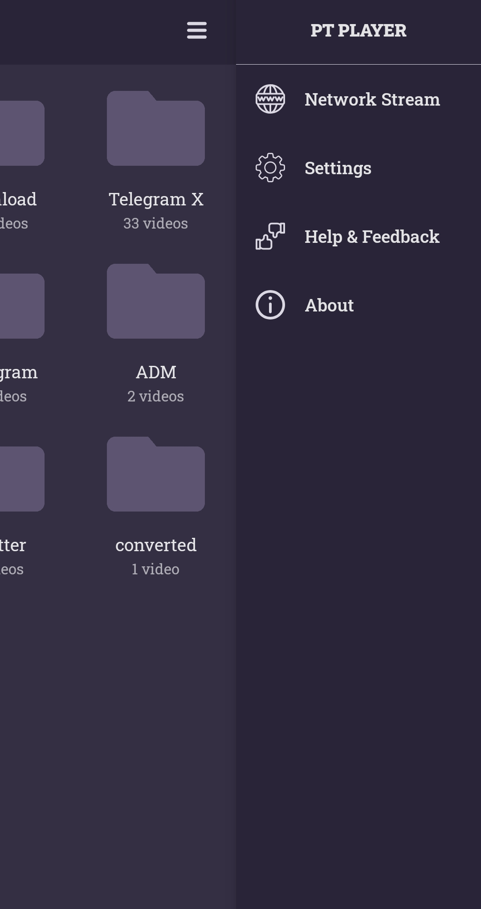

# PtPlayer

Simple Video Player for Android

|  |  |  |  |  |
|-----------------------|-----------------------|-----------------------|-----------------------|-----------------------|

## Architecture
PT-Player is based on Modular Android app architecture. modules of application devided to 4 groups:
- `Libraries` moduels : these modules are depend on only another library-modules or third-parties.
- `Shared` modules : these modules are depend on another shared-modules or library-modules or third-parties.
- `Feature` modules : these modules are depend on another feature-modules or shared-modules or library-modules or third-parties.
- `Climax` module :  these module is climax of modules and it depend on all groups of modules and some third-parties.

## What you can learn from this?
### You can learn how to use:
- Modular architecture in an Android project.
- Model-View-Intent beside of Model-View-ViewModel in Modular architecture.
- Dagger in Android in general and how to use it in a modular project.
- ExoPlayer for playing Video/Audio in offline mode or with network stream.
- Retrofit in an Android project.
- Epoxy for easier working with RecyclerViews.
- LiveData and ViewModel from the Architecture Components.
- Navigation from the Jetpack Components.
- Coroutines and Concurrency in Kotlin.

## License
Copyright 2020 Hamid-Reza Shajaravi

Licensed under the Apache License, Version 2.0 (the "License");
you may not use this file except in compliance with the License.
You may obtain a copy of the License at

    http://www.apache.org/licenses/LICENSE-2.0
    
Unless required by applicable law or agreed to in writing, software
distributed under the License is distributed on an "AS IS" BASIS,
WITHOUT WARRANTIES OR CONDITIONS OF ANY KIND, either express or implied.
See the License for the specific language governing permissions and
limitations under the License.
